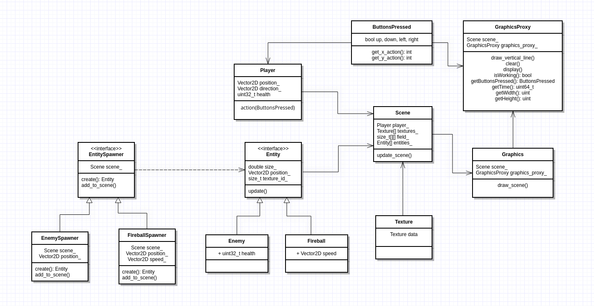

# Структура проекта
Этот проект -- псевдотрехмерный шутер (как Wolfenstein 3d), графика будет реализована на основе ray casting-а,
прочитать про этот метод можно [на википедии](https://en.wikipedia.org/wiki/Ray_casting).

В проекте есть главный объект `Scene`, который ответственен за хранение информации об объектах в мире,
игроке и карте. Также он используется для того, чтобы обновлять позицию объектов за один тик игры.

Все классы объектов являются наследниками класса `Entity` с информацией о положении, номере текстуры
и методом `update()`. Сейчас определены два класса -- `Fireball` и `Enemy`.

Графика обрабатывается в классе `Graphics`, имеющим в своем доступе ссылку на Экземпляр `Scene`.

